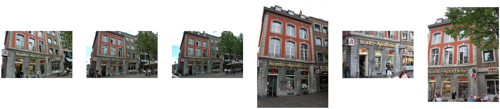

# Hierarchical visual localization pipeline
This work was done during my [master's thesis](https://syncandshare.lrz.de/dl/fiQXZ8DuirBgMeM9iJJaKFQ3/?inline) under [Prof. Leal-Taixe](https://dvl.in.tum.de/team/lealtaixe/) and [Qunjie Zhou](https://dvl.in.tum.de/team/zhouq/). 

Visual localization pipeline using following steps
1) Find similar database images (neighbors) by using global descriptors

2) Extract local descriptors from neighboring database and query image
3) Match local descriptors

4) Calculate 6-DoF pose using RANSAC scheme

|  |
|:--:|
|Overall concept|


## Current performance
### Results
Evaluation via [online evaluation system](https://www.visuallocalization.net) with [benchmark results](https://www.visuallocalization.net/benchmark/) available.


| GeM / Superpoint    | Day  | Night |
|---------------------|------|-------|
| High precision      | 71.0 | 31.6  |
| Medium precision    | 79.5 | 46.9  |
| Coarse precision    | 90.0 | 65.3  |

``` python evaluate.py --ratio_thresh 0.8 --reproj_error 14.0 --n_neighbors 20 --global_method Cirtorch --local_method Superpoint ```


| GeM / SIFT       | Day  | Night |
|------------------|------|-------|
|  High precision  | 76.3 | 19.4  |
| Medium precision | 83.7 | 28.6  |
| Coarse precision | 87.7 | 36.7  |

Command to reproduce result:  
``` python evaluate.py --ratio_thresh 0.75 --n_neighbors 20 --global_method Cirtorch ```

To use artificial night images mentioned in thesis you can download them [here](https://syncandshare.lrz.de/dl/fiDymBjT43QSsJTqueiLo1S2)

### Speed
Evaluated using following hardware:
 - Intel(R) Xeon(R) CPU E5520  @ 2.27GHz
 - GeForce GTX TITAN X
 
 |                   | Colmap     | Superpoint |
 | ----------------- | ---------- | ---------- |
 | Setup time        | 50 seconds | 45 seconds |
 | Mean time / img   | <1 seconds | 3 seconds  |
 | Median time / img | <1 seconds | 3 seconds  |
 | Max time / img    | 2 seconds  | 14 seconds |
 
## Get started
Prerequisites: 
 - Install [conda](https://docs.anaconda.com/anaconda/install/)
 - Download [AachenDayNight dataset](https://drive.google.com/drive/folders/1a4qf-ZVsuGF96xsG8_GEgo-ifcAtZMPE)
 - (Optional) Install [Colmap](https://demuc.de/colmap/)
 
Example for start on Linux
```
git clone https://github.com/a1302z/hierarchical_visual_localisation.git
cd hierarchical_visual_localisation
conda env create -f requirements.yml
mkdir data
cd data
wget https://syncandshare.lrz.de/dl/fiQXCXZ9ibmrm7rwUJzAvNL4
cd ..
mv <path to AachenDayNight dataset> data/
```

## Credits
The concept of hierarchical localisation was introduced in this [paper](https://arxiv.org/abs/1809.01019).

We used code from the following repositories.
- [HF-Net](https://www.github.com/ethz-asl/hfnet)
- [Pytorch NetVLAD](http://www.robots.ox.ac.uk/~albanie/pytorch-models.html)
- [CNN Image Retrieval (GeM)](https://github.com/filipradenovic/cnnimageretrieval-pytorch)
- [Superpoint](https://github.com/MagicLeapResearch/SuperPointPretrainedNetwork)
- [D2-Net](https://github.com/mihaidusmanu/d2-net)
- [PyTorch geometric](https://github.com/rusty1s/pytorch_geometric)

If we missed any credits please let us know.
